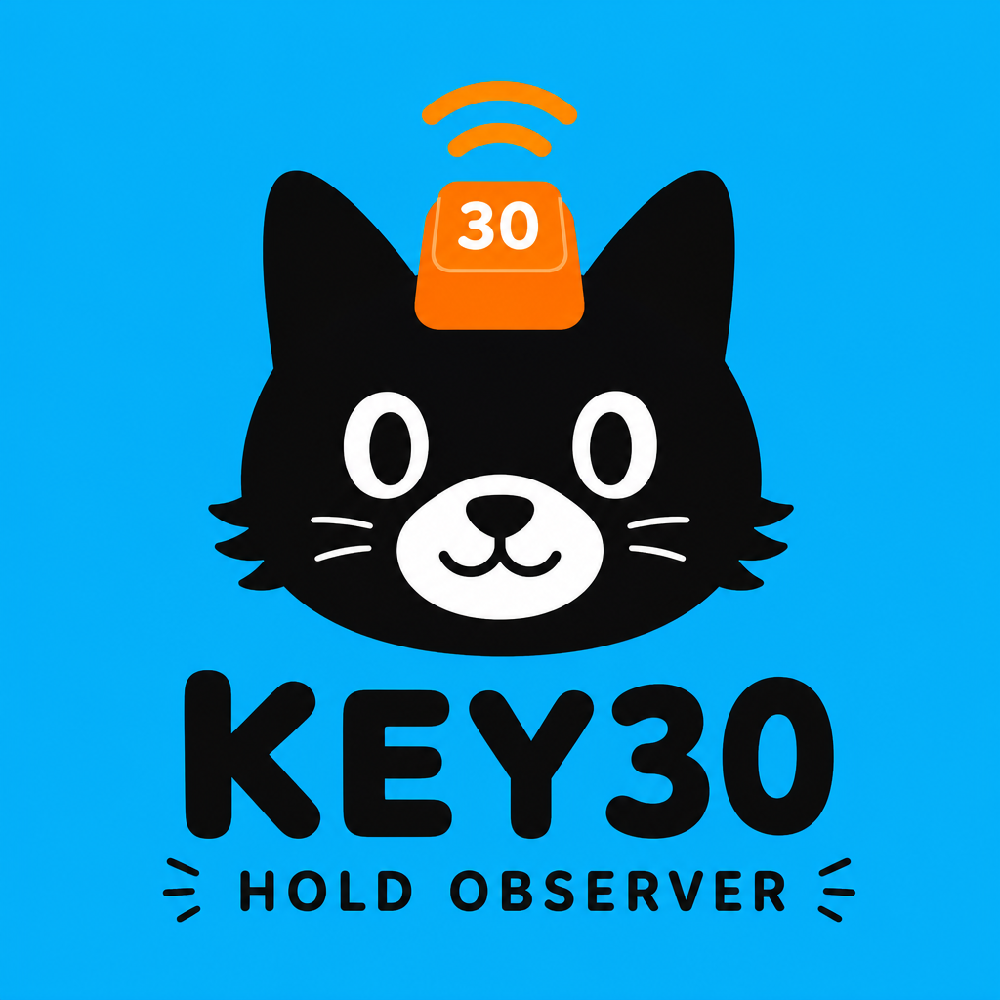

<p align="center">
  
</p>

<h1 align="center">Key30</h1>

<p align="center">
  <em>macOS menu bar keypress inspector for Tap-Hold tuning.</em>
</p>

<p align="center">
  
  
  
  
</p>

---

## Overview

**Key30** is a tiny macOS menu bar app for checking how long you actually hold a key down.
It is mainly built for tuning Tap-Hold behavior in QMK / Vial keyboards.

It shows each key down, key up, `keyCode`, and hold duration. When a key passes your hold threshold, Key30 pops up a small capsule near the bottom of the screen, so you can line up what you feel with what your firmware is doing.

> [!NOTE]
> Key30 needs Accessibility permission for global key monitoring:
> System Settings -> Privacy & Security -> Accessibility.

## Features

| Feature | What it does |
| --- | --- |
| Global key monitor | Watches letters, numbers, modifiers, arrow keys, function keys, numpad keys, and more. |
| Hold popup | Shows a bottom capsule after a key stays down longer than your threshold. |
| Threshold control | Set the threshold from 100-10,000 ms with a slider or exact millisecond input. |
| Debug mode | Logs Key Down / Key Up events with `keyCode` and `duration` in real time. |
| Stats panel | See which keys you use most and how long you usually hold them. |
| Copy logs | Copy the current debug session with one click. |
| Preferences | Switch language, turn sound on or off, and customize modifier-key capsule colors. |

## Usage

1. Open Key30 and give it Accessibility permission.
2. Click Key30 in the menu bar, then open Debug.
3. Click Start Debugging and press the key you want to test.
4. Use the logged `keyCode` and `duration` to adjust your Hold Threshold.
5. Hold a key past the threshold and the bottom capsule will show the result.

## Build

```bash
cd key30
./build.sh
open build/Key30.app
```

Build and restart in one step:

```bash
./dev.sh
```

## Project Layout

```text
key30/
├── docs/
│   └── key30-hero.png
├── MenuBarApp.swift
├── KeyMonitor.swift
├── FloatingCapsule.swift
├── SettingsView.swift
├── DebugView.swift
├── DashboardView.swift
├── KeyEventDebugger.swift
├── AppSettings.swift
├── KeyNames.swift
├── build.sh
└── dev.sh
```

## Key Files

| File | What it does |
| --- | --- |
| `MenuBarApp.swift` | Menu bar entry point, window handling, and app lifecycle. |
| `KeyMonitor.swift` | Global / local key monitoring and hold detection. |
| `FloatingCapsule.swift` | The floating bottom capsule popup. |
| `SettingsView.swift` | Threshold, language, sound, and color settings. |
| `DebugView.swift` | Key event logs, stats, and copy action. |
| `DashboardView.swift` | Usage stats and overview panel. |
| `KeyEventDebugger.swift` | Debug event collection and export. |
| `AppSettings.swift` | UserDefaults-backed settings storage. |
| `KeyNames.swift` | Maps `keyCode` values to readable key names. |
